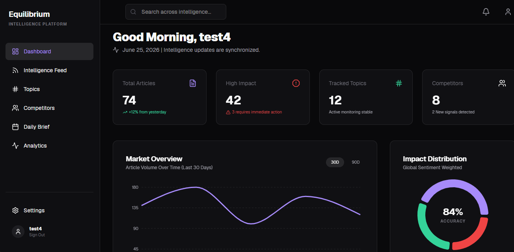
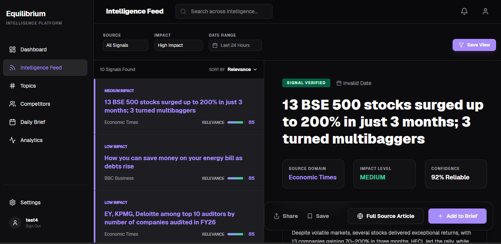
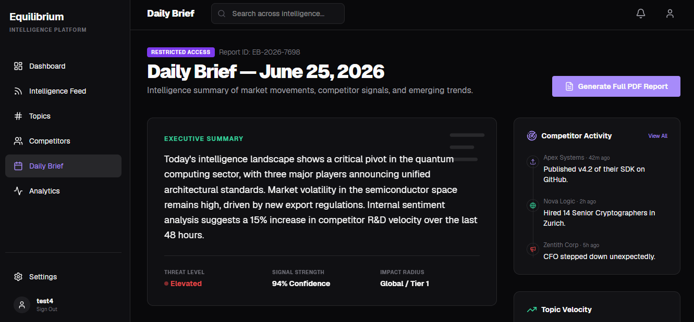
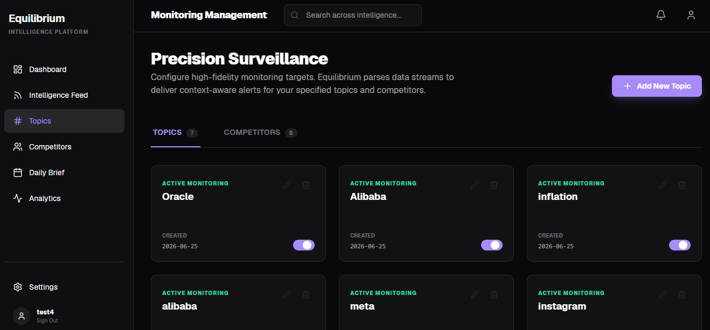
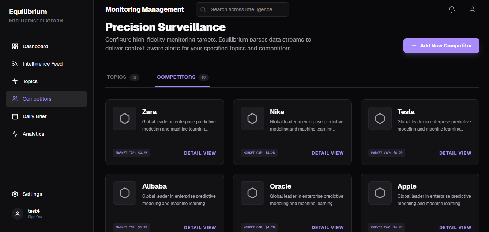
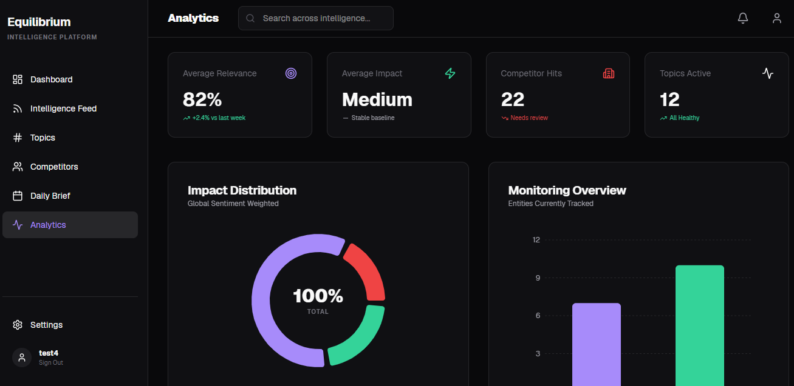
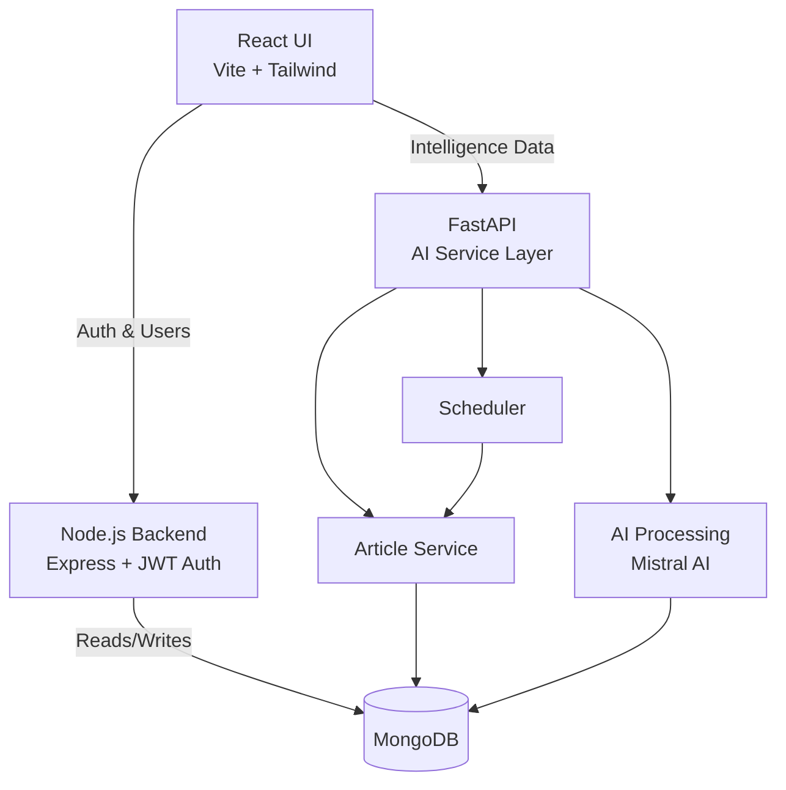
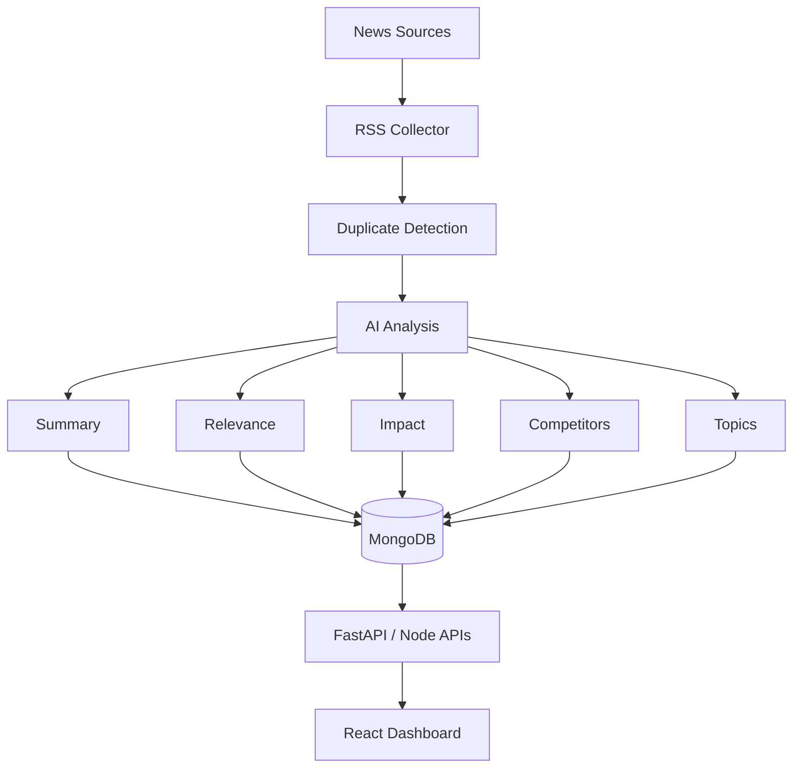
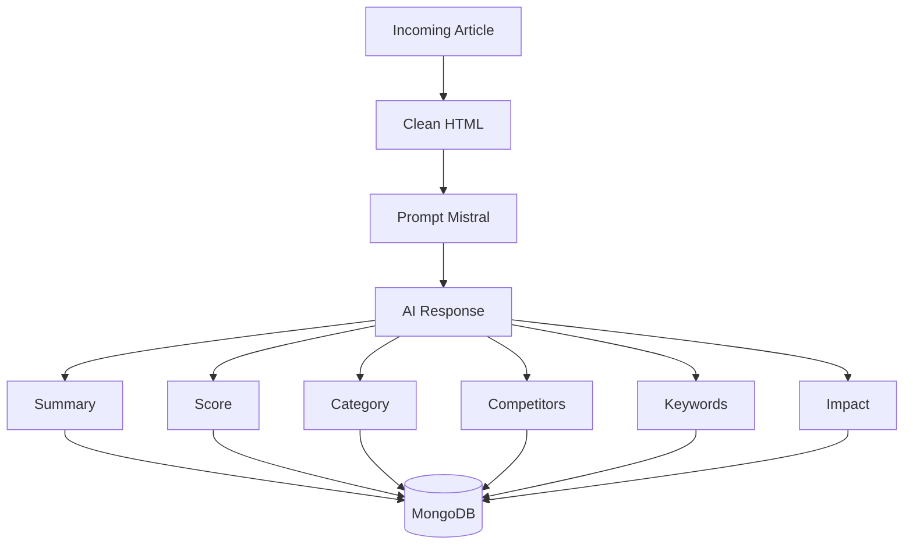

# 👗 Fashion News Monitoring Agent

> AI-powered Fashion & Economic Intelligence Platform that continuously monitors news sources, filters meaningful signals, tracks competitors and monitored topics, and generates structured intelligence reports.



---

# Overview

Fashion News Monitoring Agent is an AI-driven intelligence platform designed to monitor global fashion, retail, luxury, and economic news in real time.

The platform continuously collects articles from multiple RSS feeds and news sources, analyzes them using Large Language Models, extracts business intelligence, scores relevance, detects competitors, categorizes impact, and presents actionable insights through an enterprise dashboard.

Unlike a simple news aggregator, the system focuses on identifying meaningful business signals while filtering noisy information.

---

# Features

## AI Intelligence
- AI-powered article summarization
- Relevance scoring
- Impact classification
- Noise filtering
- Competitor detection
- Topic matching
- Daily executive brief generation
- AI-generated insights

## Monitoring
- RSS Feed Monitoring
- Custom Source Management
- Topic Management
- Competitor Tracking
- Automatic News Collection
- Scheduled Crawling

## Dashboard & Security
- Live KPI Cards
- Market Overview
- Impact Distribution
- Intelligence Feed
- Secure JWT Authentication (HTTP-Only Cookies)
- Role-based Dashboard Access

---

# Demo

| Dashboard | Feed |
|-----------|------|
|  |  |

| Daily Brief | Topics |
|-------------|--------|
|  |  |

| Competitors | Analytics |
|-------------|-----------|
|  |  |

---

# Architecture



---

# Tech Stack

## Frontend
- React
- Vite
- Tailwind CSS
- React Router
- Axios (with Credentials)
- Recharts

## Backend
- **Node.js**: Express, JWT, bcrypt (Authentication & Users)
- **FastAPI**: Python, APScheduler (AI & Scraping)
- **Database**: MongoDB
- **Scraping**: Feedparser, BeautifulSoup

## AI
- Mistral AI
- Prompt Engineering
- Article Summarization
- Impact Classification
- Relevance Scoring
- Topic Extraction

---

# Folder Structure

```text
Fashion_news_Agent
│
├── frontend              # React UI
│   ├── src
│   │   ├── api           # Axios configs (FastAPI & Node)
│   │   ├── components
│   │   ├── layouts
│   │   ├── pages
│   │   ├── context       # AuthContext
│   │   └── App.jsx
│   └── package.json
│
├── ai_service            # Python FastAPI
│   ├── app
│   ├── api
│   ├── services
│   ├── scheduler
│   ├── prompts
│   ├── core
│   └── main.py
│
├── backend               # Node.js Express Auth
│   ├── src
│   │   ├── controllers
│   │   ├── middleware
│   │   ├── models        # Mongoose User Model
│   │   ├── routes
│   │   └── server.js
│   └── package.json
│
└── README.md
```

---

# Workflow



---

# AI Pipeline



---

# REST APIs

## Auth (Node.js)
```http
POST /api/auth/register
POST /api/auth/login
POST /api/auth/logout
GET  /api/auth/me
```

## Dashboard (FastAPI)
```http
GET /dashboard-summary
```

## Articles (FastAPI)
```http
GET /articles
GET /articles/{id}
```

## Entities (FastAPI)
```http
GET /topics
POST /topics
DELETE /topics/{name}

GET /competitors
POST /competitors
DELETE /competitors/{name}
```

---

# Environment Variables

## Node.js Backend (`backend/.env`)

```env
PORT=5000
MONGO_URI=your_mongodb_uri
JWT_SECRET=your_secure_jwt_secret
```

> **Tip**: You can generate a secure `JWT_SECRET` by running the following command in your terminal:
> ```bash
> node -e "console.log(require('crypto').randomBytes(32).toString('hex'))"
> ```

## FastAPI (`ai_service/.env`)
```env
MISTRAL_API_KEY=your_api_key
MONGODB_URI=your_mongodb_uri
```

## React Frontend (`frontend/.env`)
```env
VITE_AI_SERVICE_URL=http://127.0.0.1:8000
VITE_NODE_API_URL=http://localhost:5000
```

---

# Installation

Clone
```bash
git clone https://github.com/yourusername/Fashion_news_Agent.git
```

Python AI Service
```bash
cd ai_service
python -m venv .venv
source .venv/bin/activate
pip install -r requirements.txt
uvicorn main:app --reload
```

Node Authentication Backend
```bash
cd backend
npm install
npm run dev
```

React Frontend
```bash
cd frontend
npm install
npm run dev
```

---

# Docker Setup

## Run AI Service with Docker

The AI Service (FastAPI) has a complete `Dockerfile` provided. You can run it via Docker Compose.

### Prerequisites
- Docker and Docker Compose installed
- `.env` file in `ai_service/` with required environment variables (see [Environment Variables](#environment-variables))

### Build

From the project root:
```bash
docker compose build
```

### Start

```bash
docker compose up
```

Or in detached mode:
```bash
docker compose up -d
```

### Access APIs

- **Swagger UI**: http://localhost:8000/docs
- **OpenAPI Schema**: http://localhost:8000/openapi.json
- **Dashboard Summary**: http://localhost:8000/dashboard-summary

### Stop

```bash
docker compose down
```

### Environment File

Create `ai_service/.env` with:
```env
MONGODB_URI=your_mongodb_atlas_connection_string
MISTRAL_API_KEY=your_mistral_api_key
```

Use `ai_service/.env.example` as a template.

---

# Why Mistral AI?

Mistral AI is used to transform raw news articles into structured intelligence by:
- Summarizing long articles
- Assigning impact levels
- Scoring relevance
- Extracting competitors
- Identifying monitored topics
- Generating executive summaries

This enables the platform to provide actionable intelligence instead of simply displaying news articles.

---

# Author
**Ayush Jha**
